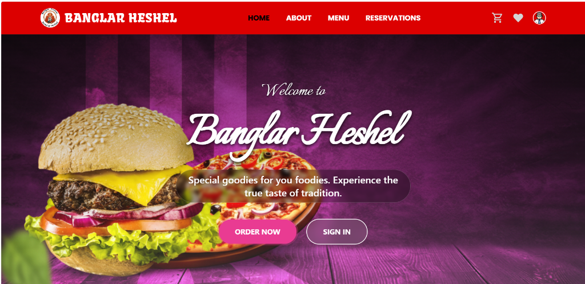
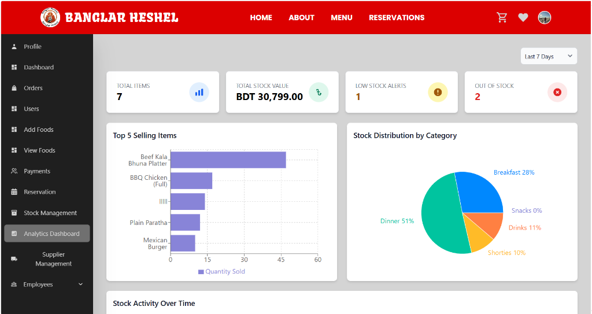

# 🍽️ Banglar Heshel - Restaurant Management System

[](https://opensource.org/licenses/MIT)
[](https://reactjs.org/)
[](https://nodejs.org/)
[](https://www.mongodb.com/)
[](https://tailwindcss.com/)

**Banglar Heshel** is a state-of-the-art Restaurant Management System designed to streamline operations and enhance the customer dining experience. Built using the robust **MERN stack** (MongoDB, Express.js, React.js, Node.js), it offers a seamless interface for customers, managers, and administrators.

---

## ✨ Key Features

### 👤 Customer Experience

- **Menu Browsing & Search**: Explore delicious food items with detailed descriptions and categories.
- **Wishlist & Cart**: Save your favorites and manage your orders easily.
- **Table Reservation**: Book your spot in advance with ease.
- **Secure Payments**: Integrated with **SSLCommerz** for online payments, plus Cash on Delivery options.
- **Order Tracking**: Real-time updates on your order status and digital receipts.
- **Reviews & Ratings**: Share your dining experience with the community.

### 🛠️ Admin & Management

- **Analytics Dashboard**: Visualized insights into sales, orders, and customer trends using **Recharts**.
- **Inventory & Stock Management**: Real-time tracking of food stock with automated transaction logging.
- **Supplier & Purchase Orders**: Manage suppliers and streamline the procurement process.
- **Menu Management**: Effortlessly add, update, or remove food categories and items.
- **Role-Based Access**: Specialized views and permissions for Admins and Managers.

---

## 🚀 Tech Stack

- **Frontend**: React (Vite), Redux Toolkit, Tailwind CSS, Flowbite React.
- **Backend**: Node.js, Express.js.
- **Database**: MongoDB (Mongoose).
- **Authentication**: Firebase Auth & Custom JWT implementation.
- **File Storage**: Cloudinary for high-performance image management.
- **Payment Gateway**: SSLCommerz Integration.

---

## 📸 Screenshots & Demos

### Home Page



### Analytics Dashboard



### 🎥 Video Demonstration

Check out the full walkthrough [here](https://github.com/user-attachments/assets/6f0e6244-15fc-4bc8-b58d-49248d2b5cdd).

---

## ⚙️ Configuration

Create a `.env` file in both `api/` and `client/` directories based on the following templates.

### Backend (`api/.env`)

```env
MONGO_URI=your_mongodb_connection_string
JWT_SECRET=your_jwt_secret
SSLCOMMERZ_STORE_ID=testbox
SSLCOMMERZ_STORE_PASSWORD=qwerty
SSLCOMMERZ_IS_LIVE=false
SSLCOMMERZ_SUCCESS_URL=http://localhost:3000/api/sslcommerz/success
SSLCOMMERZ_FAIL_URL=http://localhost:3000/api/sslcommerz/fail
SSLCOMMERZ_CANCEL_URL=http://localhost:3000/api/sslcommerz/cancel
SSLCOMMERZ_IPN_URL=http://localhost:3000/api/sslcommerz/ipn
CLOUDINARY_CLOUD_NAME=your_cloud_name
CLOUDINARY_API_KEY=your_api_key
CLOUDINARY_API_SECRET=your_api_secret
```

### Frontend (`client/.env`)

```env
VITE_FIREBASE_API_KEY=your_firebase_api_key
```

---

## 🛠️ Installation & Setup

1.  **Clone the Repository**:

    ```bash
    git clone https://github.com/Tomal-Mujumder/restaurant-management.git
    cd restaurant-management
    ```

2.  **Backend Setup**:

    ```bash
    # From the root directory
    npm install
    npm run dev  # Starts node server with nodemon
    ```

3.  **Frontend Setup**:
    ```bash
    cd client
    npm install
    npm run dev  # Starts Vite development server
    ```

---

## 🤝 Contributing

Contributions are what make the open-source community such an amazing place to learn, inspire, and create. Any contributions you make are **greatly appreciated**.

1. Fork the Project
2. Create your Feature Branch (`git checkout -b feature/AmazingFeature`)
3. Commit your Changes (`git commit -m 'Add some AmazingFeature'`)
4. Push to the Branch (`git push origin feature/AmazingFeature`)
5. Open a Pull Request

---

## 📜 License

Distributed under the MIT License. See `LICENSE` for more information.

---

## 📫 Contact & Support

**Tomal Mujumder** - [GitHub](https://github.com/Tomal-Mujumder)

Project Link: [https://github.com/Tomal-Mujumder/restaurant-management](https://github.com/Tomal-Mujumder/restaurant-management)

---

<p align="center">Made with ❤️ for great food and better management.</p>
